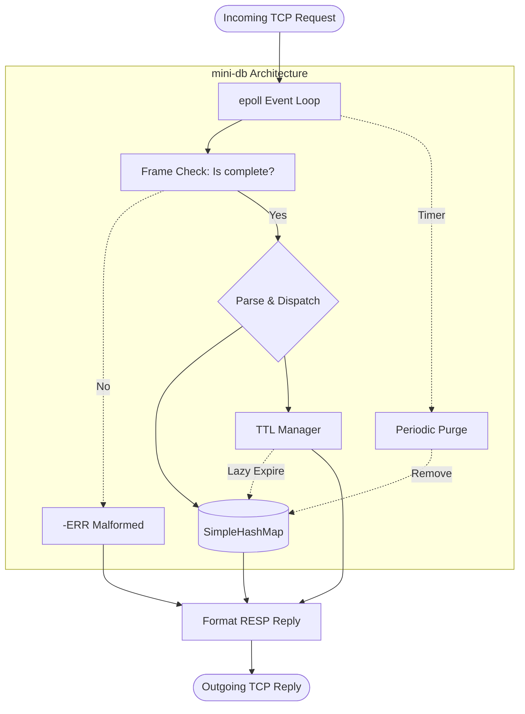

# mini-db — lightweight key-value server in C++

A small, event-driven key–value server in C++ that uses the Redis RESP protocol and supports TTL.

## Features

- Fast event-driven TCP server (epoll, non-blocking, single process)
- RESP (Redis Serialization Protocol) array/bulk-string parsing with persistent connections
- Commands: PING, SET, GET, DEL, EXISTS, EXPIRE, TTL
- TTL engine: lazy expiration on access + periodic cleanup in the loop
- Clean error handling (errno + strerror), per-connection buffers
 
- Backed by an in-house hashmap (`SimpleHashMap`) powering the key-value store
- In-memory only (no persistence)


## Implementation summary

- Event-driven server: non-blocking sockets with epoll and per-connection buffers.
- RESP protocol: array-of-bulk-strings parsing; malformed input returns `-ERR`.
- Commands and replies:
  - PING → `+PONG`
  - SET key value [EX seconds] → `+OK` (EX is case-insensitive; seconds > 0)
  - GET key → bulk string or `$-1` if not found
  - DEL key → `:1` if deleted, else `:0`
  - EXISTS key → `:1` if present, else `:0`
  - EXPIRE key seconds → `:1` if TTL set, else `:0`
  - TTL key → `:-2` (missing), `:-1` (no TTL), or `:<seconds>` remaining
- TTL behavior: lazy expiration on access, plus periodic cleanup triggered by epoll timeout calling `MiniDB::purgeExpiredKeys()`.
- Storage: an in-house `SimpleHashMap` (separate chaining, polynomial hash) backs the key-value store.

 

## How it works

- Non-blocking sockets with an epoll event loop.
- Per-connection buffers; parse RESP arrays when complete and dispatch to command handlers.
- TTL: `SET ... EX s`, `EXPIRE`, `TTL`; lazy expiration on access and periodic purge via epoll timeout (`MiniDB::purgeExpiredKeys()`).

## Architecture workflow


 

## Code layout

```text
mini-db/
├── include/
│   ├── Server.hpp           # server interface
│   ├── miniDB.hpp           # command execution API
│   ├── miniDBParser.hpp     # RESP parser interface
│   ├── TTLManager.hpp       # TTL management interface
│   ├── SimpleHashMap.hpp    # hashmap interface
│   └── SocketUtils.hpp      # socket helper declarations
└── src/
    ├── main.cpp             # server entry point
    ├── Server.cpp           # epoll loop, connection handling, client buffers
    ├── miniDB.cpp           # command dispatch + command handlers
    ├── miniDBParser.cpp     # parses RESP array-of-bulk input
    ├── TTLManager.cpp       # expiry map + heap cleanup logic
    ├── SimpleHashMap.cpp    # hashmap implementation
    └── SocketUtils.cpp      # socket setup/bind/listen helpers
```


## Getting started

Prerequisites:
- Linux
- GCC or Clang
- make
- Docker (optional, for containerized run)

### Method 1: Run locally (make)

```bash
make            # builds server
./server        # runs server (binds default port 8080)
```

### Method 2: Run with Docker

Build the image:

```bash
docker build -t mini-db .
```

Run the container (publish port 8080):

```bash
docker run --name mini-db -p 8080:8080 mini-db
```

Stop and remove container:

```bash
docker stop mini-db && docker rm mini-db
```

Troubleshooting:
- “Address already in use” on start → another server is running on that port. Kill it or change port.
 

## Protocol quick reference (RESP)

- Arrays: `*<count>\r\n`
- Bulk string: `$<len>\r\n<data>\r\n`
- Simple string: `+OK\r\n`
- Integer: `:<n>\r\n`
- Errors: `-ERR ...\r\n`

Example frames:
- `PING` → `*1\r\n$4\r\nPING\r\n`
- `SET a v` → `*3\r\n$3\r\nSET\r\n$1\r\na\r\n$1\r\nv\r\n`
- `SET a v EX 5` → 5s TTL
 

## TTL behavior details

- EXPIRE returns `:1` only if the key exists and TTL is set; otherwise `:0`.
- TTL returns:
	- `:-2` when the key doesn’t exist (or just expired and got cleaned)
	- `:-1` when a key exists without TTL
	- `:<seconds>` remaining when TTL is set
- Lazy expiration cleans key on first access if TTL is due.
- Periodic cleanup runs every ~1s even when idle (epoll timeout), so expired keys get removed without client access.
 

 

## Benchmarking (optional)

```bash
redis-benchmark -h 127.0.0.1 -p 8080 -t set,get -n 20000 -q
```

Benchmark results:
- Command: `redis-benchmark -h 127.0.0.1 -p 8080 -t set,get -n 20000 -q`
- SET throughput: 28050.49 ops/sec (p50=1.079 ms)
- GET throughput: 32310.18 ops/sec (p50=0.463 ms)

Note: Only the implemented Redis commands will work; others return `-ERR unknown command`.
 

## Using redis-cli

Start a session once, then run commands interactively:

```bash
redis-cli -h 127.0.0.1 -p 8080
```

Inside the prompt, for example:

```
PING
SET name mohanish
GET name
SET temp value EX 5
TTL temp
```

 
